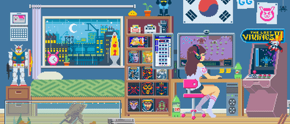
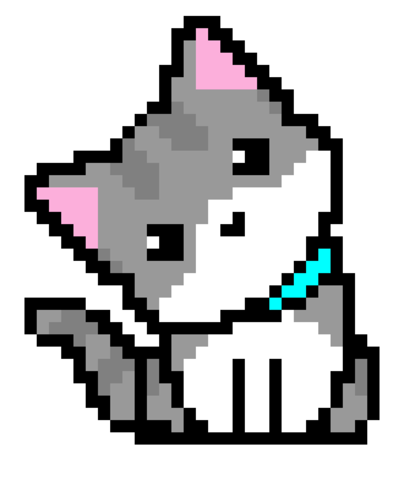
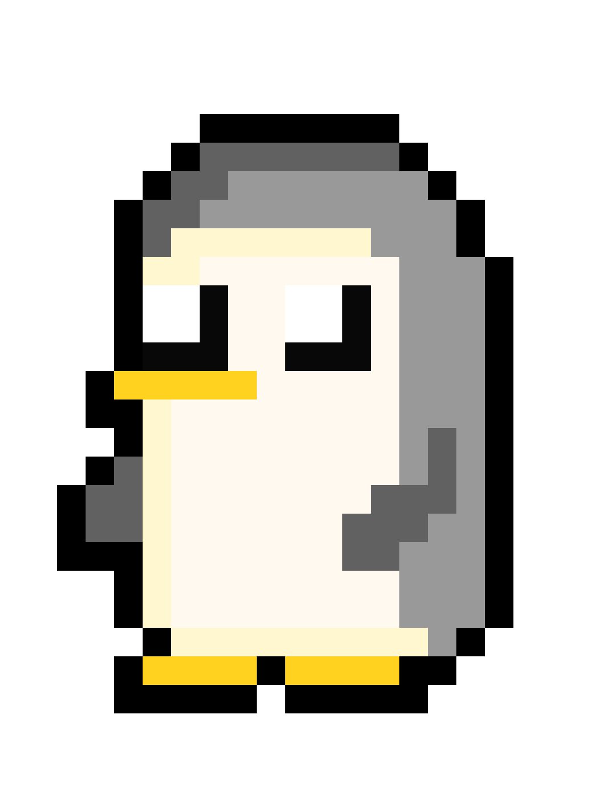

```csharp
~$ open blog
```


```csharp
Redirecting to blog system...
----------------------------------------
Blog Engine: GitHub Pages (separate repo)
Status     : active
Endpoint   : https://matrix-7337.github.io/blog
```
```csharp
Recent posts:
  > Hidden-In-Plainsight
  > Intro
```
```csharp
~$ rm -rf blog
```


```csharp
Deleting blog system...
----------------------------------------
Status    : Deactivated

>> Wait I only wanted to Clear
>> I have to build that again
>> ᕙ( ᗒᗣᗕ )ᕗ

>> Ohh Gosh! Finnaly here
       |
       ⮛
```
[](https://matrix-7337.github.io/blog)
[](https://matrix-7337.github.io/blog)
